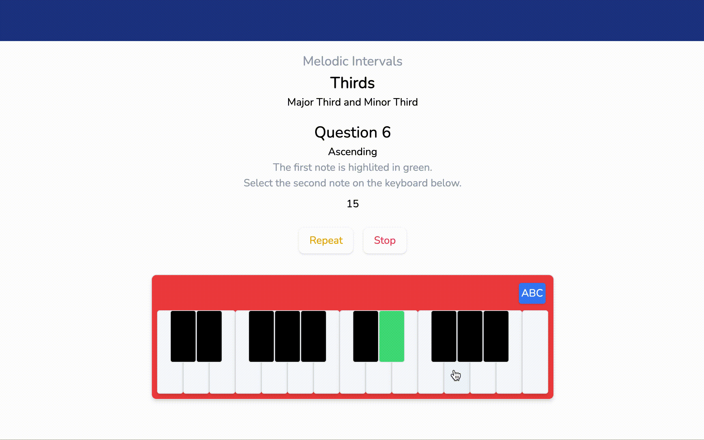

# Aural Gymnasium

## Disclaimer
The DB features are currently offline as Heroku's Postgresql free plan is no longer available.

## Overview
One of the most useful skills for a musician is the ability to aurally recognize intervals (the distance between notes). The Aural Gymnasium is a free resource for anyone to develop this skill. 

## Features
The user is presented with about 40 challenges, covering the following areas:
  - Melodic intervals
  - Harmonic intervals
  - Triads
  - Basic four-note chords

The user will hear tones (created with Tone.js) and will submit what they believe they heard via an onscreen piano keyboard.

On top of this, the user can create an account to track their progress, review their recent activity and see their daily streak.

## Stack
- Next JS
- Tone.js
- react-use-precision-timer
- Tailwind
- NextAuth
- Prisma
- PostGresQL
- Nodemailer
- Formik and Yup

